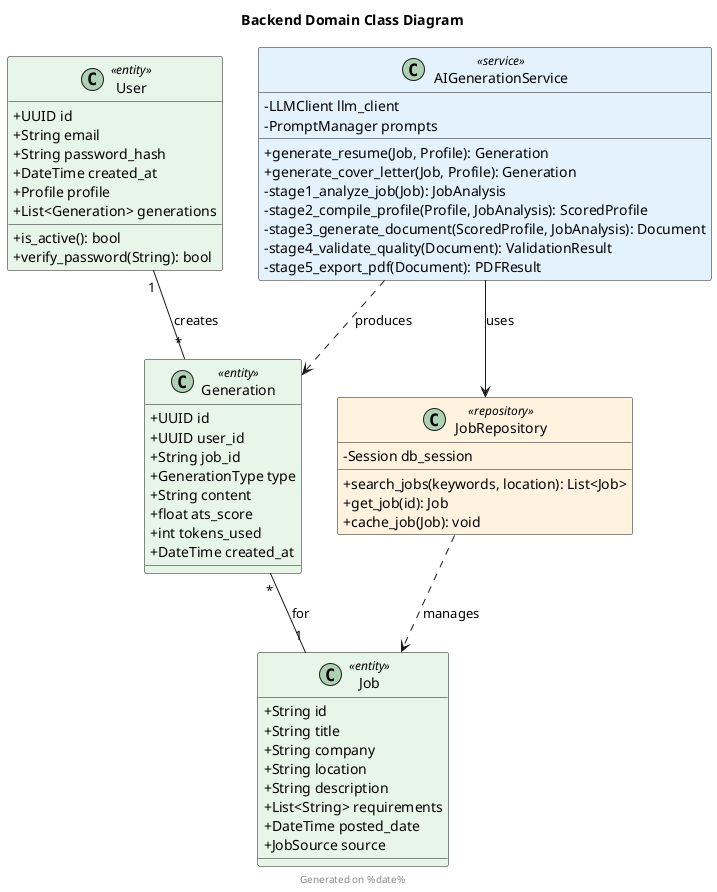
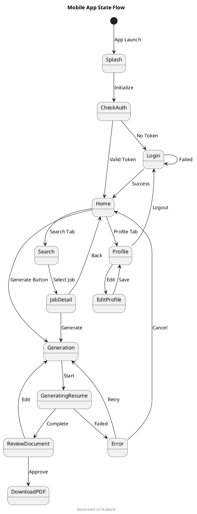
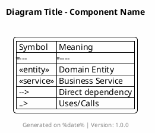
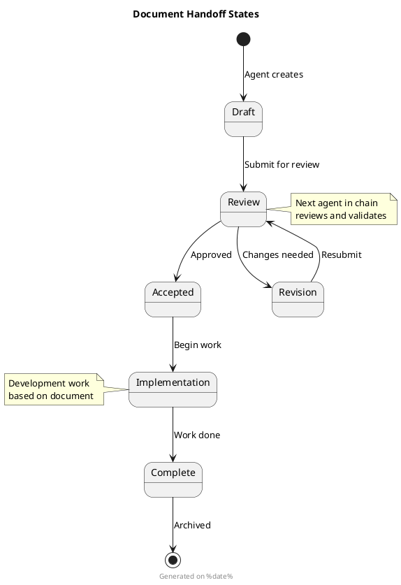

# Optimized Multi-Agent Documentation Framework
## JobWise AI Development System - Streamlined Context Management

### Core Philosophy
- **JBGE (Just Barely Good Enough)**: Documentation should be minimal yet sufficient
- **Living Documentation**: Evolves with code, always current
- **Single Source of Truth**: One document per concern, no duplication
- **AI-Optimized Format**: Simple, structured, parseable by AI agents

---

## 📁 Optimized Context Folder Structure

```
.context/
├── architecture/
│   ├── system-design.md          # C4 model + ADRs (no code)
│   └── implementation-plan.md    # Technical roadmap (no code)
├── requirements/
│   └── user-stories.feature      # Business requirements in Gherkin
├── api/
│   └── openapi-spec.yaml         # Complete API specification
├── mobile/
│   └── ui-state-models.md        # UI components + state management
├── testing/
│   └── test-specification.md     # Test strategies + execution reports
├── diagrams/
│   ├── architecture/              # C4 diagrams (PlantUML)
│   ├── backend/                   # Class, sequence, ER diagrams
│   ├── mobile/                    # UI flow, state diagrams
│   └── testing/                   # Test flow diagrams
└── handoff/
    └── sprint-status.md           # Current sprint status & handoffs
```

---

## 🤖 Agent Document Assignments

### Business Analyst (1 Document)
**Document**: `.context/requirements/user-stories.feature`
**Format**: Gherkin/BDD
**Purpose**: Business requirements and acceptance criteria

### Solutions Architect (2 Documents - NO CODE)  
**Document 1**: `.context/architecture/system-design.md`
**Format**: C4 Model + ADRs (architecture only, no implementation code)
**Purpose**: High-level architecture decisions and system boundaries

**Document 2**: `.context/architecture/implementation-plan.md`
**Format**: Technical roadmap and guidelines (no code examples)
**Purpose**: Implementation strategy and technical approach

### Backend Developer (2 Documents)
**Document 1**: `.context/api/openapi-spec.yaml`
**Format**: OpenAPI 3.0 Specification
**Purpose**: API contracts and backend interfaces

**Diagrams**: `.context/diagrams/backend/`
**Format**: PlantUML class diagrams, sequence diagrams, ER diagrams
**Purpose**: Implementation-level technical diagrams

### Mobile Developer (2 Documents)
**Document 1**: `.context/mobile/ui-state-models.md`
**Format**: Component specifications and state management
**Purpose**: Frontend architecture and UI components

**Diagrams**: `.context/diagrams/mobile/`
**Format**: PlantUML class diagrams, state machines, UI flows
**Purpose**: Mobile app technical diagrams

### QA Engineer (1 Document - SEPARATE from BA)
**Document**: `.context/testing/test-specification.md`
**Format**: Test strategies, test cases, execution reports
**Purpose**: Quality assurance planning and results tracking

---

## 📋 Document Templates

### 1. System Architecture Document (Solutions Architect)
**File**: `.context/architecture/system-design.md`
**Note**: NO CODE - Architecture decisions and diagrams only

```markdown
# JobWise System Architecture

## Executive Summary
AI-powered job application assistant using microservices architecture with mobile frontend.

## System Boundaries
- In Scope: Job search, AI generation, user management
- Out of Scope: Payment processing, job posting
- External Dependencies: OpenAI API, Indeed API

## C4 Model Reference
All architecture diagrams located in: `/diagrams/architecture/`
- context-diagram.puml
- container-diagram.puml  
- component-diagram.puml

## Architecture Decision Records

### ADR-001: Microservices vs Monolith
**Status**: Accepted
**Context**: Need to scale AI generation independently
**Decision**: Microservices architecture with API gateway
**Rationale**: 
- Independent scaling of AI pipeline
- Technology flexibility per service
- Fault isolation
**Consequences**: 
- Increased operational complexity
- Need service discovery mechanism
- Network latency considerations

### ADR-002: State Management Strategy
**Status**: Accepted
**Context**: Mobile app needs offline capability
**Decision**: Local-first with server sync
**Rationale**:
- Better user experience
- Works offline
- Reduces server load
**Trade-offs**:
- Conflict resolution complexity
- Storage requirements on device

### ADR-003: AI Provider Strategy
**Status**: Accepted
**Context**: Need reliable text generation
**Decision**: Primary/fallback provider pattern
**Rationale**:
- Avoid single point of failure
- Cost optimization
- Performance flexibility
**Implementation Notes**:
- Primary: GPT-4 for quality
- Fallback: GPT-3.5 for availability
- Circuit breaker pattern required

## Quality Attributes
| Attribute | Target | Measurement |
|-----------|--------|-------------|
| Performance | <2s API response | 95th percentile |
| Availability | 99.9% uptime | Monthly average |
| Scalability | 10x growth ready | Load test verified |
| Security | OWASP Top 10 | Quarterly audit |
| Usability | 4.5+ app rating | Store reviews |

## Technology Selection Rationale
- **Flutter**: Cross-platform efficiency, single codebase
- **FastAPI**: High performance, async support, auto-documentation
- **PostgreSQL**: ACID compliance, JSON support, proven reliability
- **Redis**: Sub-millisecond latency, session management
- **Docker**: Environment consistency, easy deployment
```

### 2. Implementation Plan (Solutions Architect)
**File**: `.context/architecture/implementation-plan.md`
**Note**: NO CODE - Technical roadmap and guidelines only

```markdown
# Implementation Plan & Technical Guidelines

## Development Phases

### Phase 1: Foundation (Week 1-2)
**Objective**: Core infrastructure setup

**Backend Tasks**:
- API gateway configuration
- Database schema implementation
- Authentication service
- Basic error handling

**Mobile Tasks**:
- Navigation structure
- Authentication flow
- Local storage setup
- API client configuration

**Deliverables**:
- Working authentication
- Basic project structure
- CI/CD pipeline

### Phase 2: Core Features (Week 3-4)
**Objective**: Job search and profile management

**Backend Tasks**:
- Job search endpoints
- Profile CRUD operations
- Caching layer
- Search optimization

**Mobile Tasks**:
- Job search UI
- Profile management screens
- Offline data sync
- Search filters

**Deliverables**:
- Functional job search
- User profiles
- Basic offline support

### Phase 3: AI Integration (Week 5-6)
**Objective**: Generation pipeline implementation

**5-Stage Pipeline Architecture**:
1. Job Analysis - Parse requirements
2. Profile Compilation - Score relevance
3. Document Generation - Create content
4. Quality Validation - Check compliance
5. Export - Generate PDFs

**Integration Points**:
- LLM provider abstraction
- Token management
- Rate limiting
- Response caching

### Phase 4: Polish & Optimization (Week 7-8)
**Objective**: Production readiness

**Focus Areas**:
- Performance optimization
- Error recovery
- Analytics integration
- A/B testing framework

## Technical Guidelines

### API Design Principles
- RESTful conventions
- Versioned endpoints (/v1/)
- Consistent error format
- Pagination for lists
- Field filtering support

### Mobile Architecture Patterns
- Repository pattern for data
- Provider for state management
- Dependency injection
- Separation of concerns

### Database Design Standards
- Normalized to 3NF minimum
- UUID primary keys
- Soft deletes where appropriate
- Audit columns (created_at, updated_at)
- Index optimization strategy

### Security Requirements
- JWT with refresh tokens
- Rate limiting per user
- Input validation
- SQL injection prevention
- XSS protection
- Secure credential storage

## Risk Mitigation Strategies

| Risk | Impact | Mitigation |
|------|--------|------------|
| LLM API downtime | High | Fallback provider + cache |
| Token cost overrun | Medium | Budget alerts + limits |
| Slow generation | Medium | Queue system + progress UI |
| Data privacy | High | Encryption + compliance |

## Success Metrics
- API response time <2s (p95)
- Generation time <30s
- ATS score >85%
- Zero critical vulnerabilities
- 80% test coverage
```

### 2. API Specification (Backend Developer)
**File**: `.context/api/openapi-spec.yaml`

```yaml
openapi: 3.0.3
info:
  title: JobWise API
  version: 1.0.0
  description: AI-powered job application assistant API
servers:
  - url: http://localhost:8000/api/v1
    description: Development server
  - url: https://api.jobwise.ai/v1
    description: Production server

paths:
  /auth/login:
    post:
      summary: User login
      operationId: loginUser
      requestBody:
        required: true
        content:
          application/json:
            schema:
              $ref: '#/components/schemas/LoginRequest'
      responses:
        '200':
          description: Login successful
          content:
            application/json:
              schema:
                $ref: '#/components/schemas/LoginResponse'
        '401':
          $ref: '#/components/responses/Unauthorized'

  /jobs/search:
    get:
      summary: Search jobs
      operationId: searchJobs
      parameters:
        - name: keywords
          in: query
          required: true
          schema:
            type: string
          example: "python developer"
        - name: location
          in: query
          schema:
            type: string
          example: "Seattle, WA"
      responses:
        '200':
          description: Search results
          content:
            application/json:
              schema:
                $ref: '#/components/schemas/JobSearchResponse'

  /generate/resume:
    post:
      summary: Generate tailored resume
      operationId: generateResume
      security:
        - bearerAuth: []
      requestBody:
        required: true
        content:
          application/json:
            schema:
              $ref: '#/components/schemas/GenerationRequest'
      responses:
        '200':
          description: Generated resume
          content:
            application/json:
              schema:
                $ref: '#/components/schemas/GenerationResponse'

components:
  schemas:
    LoginRequest:
      type: object
      required:
        - email
        - password
      properties:
        email:
          type: string
          format: email
        password:
          type: string
          format: password
          minLength: 8
    
    Job:
      type: object
      properties:
        id:
          type: string
        title:
          type: string
        company:
          type: string
        location:
          type: string
        salary:
          type: string
        description:
          type: string
    
    GenerationRequest:
      type: object
      required:
        - jobId
        - profileId
      properties:
        jobId:
          type: string
        profileId:
          type: string
        customization:
          type: object
          
  securitySchemes:
    bearerAuth:
      type: http
      scheme: bearer
      bearerFormat: JWT
```

### 3. Business Requirements (Business Analyst)
**File**: `.context/requirements/user-stories.feature`

```gherkin
Feature: Job Search and Application
  As a job seeker
  I want to search for jobs and generate tailored applications
  So that I can increase my chances of getting hired

  Background:
    Given I am a registered user
    And I have completed my profile

  @epic:search @priority:must-have
  Scenario: Search for relevant jobs
    Given I am on the job search screen
    When I enter "Python Developer" in the search field
    And I select "Seattle, WA" as location
    And I tap the search button
    Then I should see a list of relevant jobs
    And each job should display title, company, and location

  @epic:generation @priority:must-have
  Scenario: Generate tailored resume
    Given I have selected a "Software Engineer" job at "TechCorp"
    When I tap "Generate Resume"
    Then the system should analyze the job requirements
    And match my profile skills to the job
    And generate a tailored resume
    And display the ATS compatibility score

  @epic:profile @priority:should-have
  Scenario: Update professional profile
    Given I am on my profile screen
    When I add a new work experience
    And I specify the role, company, and duration
    And I describe my achievements
    Then the experience should be saved to my profile
    And be available for resume generation

  @epic:validation @priority:must-have
  Scenario Outline: Validate required fields
    Given I am on the <screen>
    When I leave <field> empty
    And I try to <action>
    Then I should see "<error_message>"

    Examples:
      | screen   | field    | action   | error_message           |
      | login    | email    | sign in  | Email is required       |
      | login    | password | sign in  | Password is required    |
      | profile  | name     | save     | Name is required        |

  # Acceptance Criteria Mapping
  # AC-001: Search results must load within 2 seconds
  # AC-002: ATS score must be displayed as percentage
  # AC-003: Generated resume must be downloadable as PDF
  # AC-004: All form validations must show inline errors
```

### 4. Test Specification (QA Engineer)
**File**: `.context/testing/test-specification.md`

```markdown
# Test Specification & Quality Report

## Test Strategy Overview

### Testing Levels
1. **Unit Testing**: 80% coverage target
2. **Integration Testing**: API contract validation
3. **E2E Testing**: Critical user journeys
4. **Performance Testing**: Load and stress tests
5. **Security Testing**: OWASP Top 10

### Test Automation Framework
- **Mobile**: Flutter Driver + Integration Tests
- **Backend**: Pytest + FastAPI TestClient
- **E2E**: Appium for cross-platform
- **Performance**: Locust for load testing

## Test Scenarios

### TS-001: Authentication Flow
**Priority**: P1
**Type**: E2E
**Status**: ✅ Passed

| Step | Action | Expected | Actual | Result |
|------|--------|----------|--------|--------|
| 1 | Open app | Login screen displays | As expected | ✅ |
| 2 | Enter invalid email | Error message shows | As expected | ✅ |
| 3 | Enter valid credentials | User logged in | As expected | ✅ |
| 4 | Check token storage | Token stored securely | As expected | ✅ |

### TS-002: Job Search Performance
**Priority**: P1
**Type**: Performance
**Status**: ✅ Passed

| Metric | Target | Actual | Result |
|--------|--------|--------|--------|
| Response Time (p50) | <1s | 0.8s | ✅ |
| Response Time (p95) | <2s | 1.5s | ✅ |
| Response Time (p99) | <3s | 2.2s | ✅ |
| Throughput | 100 req/s | 125 req/s | ✅ |

### TS-003: AI Generation Quality
**Priority**: P1
**Type**: Functional
**Status**: ⚠️ Partial Pass

| Test Case | Expected | Actual | Result |
|-----------|----------|--------|--------|
| Generate for SWE role | ATS >85% | 87% | ✅ |
| Generate for PM role | ATS >85% | 82% | ❌ |
| Generation time | <30s | 25s | ✅ |
| Token usage | <8000 | 7200 | ✅ |

## Defect Tracking

### Open Defects
| ID | Severity | Component | Description | Status |
|----|----------|-----------|-------------|--------|
| BUG-001 | P2 | Mobile | PDF font missing on Android | In Progress |
| BUG-002 | P3 | Backend | Slow query on job search | Open |
| BUG-003 | P2 | Generation | PM resumes low ATS score | Under Investigation |

## Test Execution Report

### Sprint 1 Summary
- **Total Tests**: 45
- **Passed**: 40 (89%)
- **Failed**: 3 (7%)
- **Blocked**: 2 (4%)
- **Coverage**: 76%

### Risk Assessment
1. **High Risk**: Generation quality for non-technical roles
2. **Medium Risk**: Android PDF rendering
3. **Low Risk**: Performance under normal load

## Quality Metrics Dashboard

| Metric | Target | Current | Trend |
|--------|--------|---------|-------|
| Code Coverage | 80% | 76% | ↑ |
| Bug Escape Rate | <5% | 3% | → |
| Test Automation | 70% | 65% | ↑ |
| Mean Time to Detect | <1 day | 18 hrs | ↓ |

## Test Environment Configuration

### Mobile Test Devices
- iOS: iPhone 12 (iOS 15), iPad Air (iPadOS 15)
- Android: Pixel 5 (Android 12), Samsung S21 (Android 13)

### Backend Test Environment
- API: Staging server (https://staging-api.jobwise.ai)
- Database: PostgreSQL 15 (test data set)
- Cache: Redis 7 (isolated instance)
```

### 5. API Specification (Backend Developer)
**File**: `.context/api/openapi-spec.yaml`

```yaml
openapi: 3.0.3
info:
  title: JobWise API
  version: 1.0.0
  description: AI-powered job application assistant API
servers:
  - url: http://localhost:8000/api/v1
    description: Development server
  - url: https://api.jobwise.ai/v1
    description: Production server

paths:
  /auth/login:
    post:
      summary: User login
      operationId: loginUser
      requestBody:
        required: true
        content:
          application/json:
            schema:
              $ref: '#/components/schemas/LoginRequest'
      responses:
        '200':
          description: Login successful
          content:
            application/json:
              schema:
                $ref: '#/components/schemas/LoginResponse'
        '401':
          $ref: '#/components/responses/Unauthorized'

  /jobs/search:
    get:
      summary: Search jobs
      operationId: searchJobs
      parameters:
        - name: keywords
          in: query
          required: true
          schema:
            type: string
          example: "python developer"
        - name: location
          in: query
          schema:
            type: string
          example: "Seattle, WA"
        - name: limit
          in: query
          schema:
            type: integer
            default: 20
            minimum: 1
            maximum: 100
      responses:
        '200':
          description: Search results
          content:
            application/json:
              schema:
                $ref: '#/components/schemas/JobSearchResponse'

  /generate/resume:
    post:
      summary: Generate tailored resume
      operationId: generateResume
      security:
        - bearerAuth: []
      requestBody:
        required: true
        content:
          application/json:
            schema:
              $ref: '#/components/schemas/GenerationRequest'
      responses:
        '200':
          description: Generated resume
          content:
            application/json:
              schema:
                $ref: '#/components/schemas/GenerationResponse'
        '429':
          description: Rate limit exceeded
        '503':
          description: AI service unavailable

components:
  schemas:
    LoginRequest:
      type: object
      required:
        - email
        - password
      properties:
        email:
          type: string
          format: email
        password:
          type: string
          format: password
          minLength: 8
    
    Job:
      type: object
      properties:
        id:
          type: string
          format: uuid
        title:
          type: string
          maxLength: 200
        company:
          type: string
          maxLength: 100
        location:
          type: string
        salary:
          type: string
        description:
          type: string
        requirements:
          type: array
          items:
            type: string
        posted_date:
          type: string
          format: date-time
    
    GenerationRequest:
      type: object
      required:
        - job_id
        - profile_id
      properties:
        job_id:
          type: string
          format: uuid
        profile_id:
          type: string
          format: uuid
        optimization_level:
          type: string
          enum: [basic, standard, premium]
          default: standard
          
  securitySchemes:
    bearerAuth:
      type: http
      scheme: bearer
      bearerFormat: JWT
```

**Backend Diagrams Location**: `.context/diagrams/backend/`

Example Backend Class Diagram:
**File**: `.context/diagrams/backend/domain-models.puml`


### 6. Mobile UI & State Models (Mobile Developer)
**File**: `.context/mobile/ui-state-models.md`

```markdown
# Mobile UI Components & State Management

## UI Component Architecture

### Screen Structure
- **Navigation**: Bottom navigation with 4 tabs
- **Routing**: Named routes with deep linking support
- **Theme**: Material Design 3 with custom color scheme

### Core Screens
1. **HomeScreen**: Job feed with filters
2. **SearchScreen**: Advanced search interface
3. **ProfileScreen**: User profile management
4. **GenerationScreen**: Resume/cover letter generation

## State Management Architecture

### Provider Structure
- **AuthProvider**: Authentication state
- **JobProvider**: Job search and listing state
- **ProfileProvider**: User profile data
- **GenerationProvider**: Document generation state

### State Models
See diagrams in: `.context/diagrams/mobile/`
- app-state.puml: Overall state structure
- navigation-flow.puml: Screen navigation diagram
- widget-hierarchy.puml: Component tree

## Widget Specifications

### JobCard Widget
**Purpose**: Display job listing in feed
**Props**: Job object, onTap callback
**State**: Favorited status
**Constraints**: Max height 200dp

### GenerationProgress Widget
**Purpose**: Show AI generation progress
**Props**: Progress percentage, stage name
**State**: Animation state
**Constraints**: Must be cancellable

## Data Flow Patterns

### API Integration
- Repository pattern for data access
- Service layer for business logic
- DTO mapping at boundaries

### Offline Strategy
- SQLite for local persistence
- Sync queue for offline actions
- Conflict resolution: Last-write-wins

## Performance Requirements
- List scrolling: 60 FPS
- Screen transition: <300ms
- API response handling: Show skeleton
- Image loading: Progressive with placeholder
```

**Mobile Diagrams Location**: `.context/diagrams/mobile/`

Example Mobile State Diagram:
**File**: `.context/diagrams/mobile/app-state.puml`


### 5. Sprint Status (All Agents)
**File**: `.context/handoff/sprint-status.md`

```markdown
# Sprint Status & Handoffs

## Current Sprint: Week 9 Sprint 1
**Status**: In Progress
**Focus**: Foundation Setup

## Handoff Queue

### Ready for Development
- [ ] API: `/auth/login` endpoint (Backend)
- [ ] UI: Login screen (Mobile)
- [ ] Test: Login scenarios (QA)

### In Progress
- [x] Architecture design (SA) → 90% complete
- [ ] API specification (Backend) → 50% complete
- [ ] Test scenarios (BA) → 70% complete

### Blocked
- [ ] PDF generation - waiting for font licensing decision

## Agent Coordination Log

| Date | From | To | Artifact | Status |
|------|------|----|----------|--------|
| 2024-01-15 | BA | SA | test-scenarios.feature v1 | ✓ Accepted |
| 2024-01-15 | SA | Backend | openapi-spec.yaml v1 | ✓ Accepted |
| 2024-01-16 | Backend | Mobile | API contracts | 🔄 In Review |

## Next Actions
1. Backend: Complete auth endpoints
2. Mobile: Implement login UI
3. QA: Prepare test automation setup
```

---

## 📐 PlantUML Diagram Standards

### Diagram Organization
All diagrams stored in `.context/diagrams/` with subdirectories by agent:
```
diagrams/
├── architecture/      # Solutions Architect (C4 diagrams only)
│   ├── context.puml
│   ├── container.puml
│   └── component.puml
├── backend/          # Backend Developer
│   ├── domain-models.puml  # Class diagrams
│   ├── api-sequence.puml   # Sequence diagrams
│   └── database-er.puml    # ER diagrams
├── mobile/           # Mobile Developer  
│   ├── app-state.puml      # State machines
│   ├── widget-tree.puml    # Component hierarchy
│   └── navigation.puml     # Navigation flow
└── testing/          # QA Engineer
    ├── test-flow.puml       # Test execution flow
    └── coverage-map.puml    # Coverage visualization
```

### Required Header for ALL Diagrams


### Diagram Types by Agent

#### Solutions Architect (NO implementation details)
- **C4 Context**: System boundaries and external actors
- **C4 Container**: High-level technical building blocks
- **C4 Component**: Logical components within containers
- **NO code-level diagrams**

#### Backend Developer
- **Class Diagrams**: Domain models, services, repositories
- **Sequence Diagrams**: API request flows
- **ER Diagrams**: Database relationships
- **Component Diagrams**: Service dependencies

#### Mobile Developer
- **State Diagrams**: App navigation and state transitions
- **Class Diagrams**: Data models and state classes
- **Component Diagrams**: Widget hierarchy
- **Activity Diagrams**: User interaction flows

#### QA Engineer
- **Activity Diagrams**: Test execution flows
- **Use Case Diagrams**: Test scenarios
- **Timing Diagrams**: Performance test results
- **Deployment Diagrams**: Test environment setup

### PlantUML Best Practices
1. **One concept per diagram** - Don't overcrowd
2. **Consistent colors** - Use skinparam for theming
3. **Clear labels** - Full names, no abbreviations
4. **Version in footer** - Track diagram evolution
5. **Legend always** - Explain symbols and colors
6. **Max 20 elements** - Split complex diagrams

---

## 🤝 Handoff Protocols

### Document State Machine


### Handoff Matrix

| From | To | Document | Trigger |
|------|-----|---------|---------|
| BA | SA | user-stories.feature | Requirements complete |
| SA | Backend | implementation-plan.md | Architecture approved |
| SA | Mobile | implementation-plan.md | Architecture approved |
| Backend | QA | openapi-spec.yaml | API implemented |
| Mobile | QA | ui-state-models.md | UI implemented |
| QA | SA | test-specification.md | Issues found |

### Handoff Checklist Template
```markdown
## Handoff: [Source Agent] → [Target Agent]
**Document**: [filename]
**Version**: [semantic version]
**Date**: [ISO date]

### Completeness Check
- [ ] All sections populated
- [ ] Diagrams in /diagrams/ folder
- [ ] No placeholders or TODOs
- [ ] Examples provided where needed

### Quality Check
- [ ] Follows agent-specific template
- [ ] Consistent terminology used
- [ ] PlantUML diagrams render correctly
- [ ] Cross-references accurate

### Specific Items for Review
1. [Specific section or decision]
2. [Area needing validation]
3. [Dependencies to verify]

### Expected Actions
- [ ] Review and validate document
- [ ] Update sprint-status.md
- [ ] Create/update related diagrams
- [ ] Begin implementation/testing
```

---

## 🎯 AI Agent Instructions

### Document Ownership & Rules

| Agent | Primary Documents | Diagram Types | Key Rules |
|-------|------------------|---------------|-----------|
| Business Analyst | user-stories.feature | None | Business language only, no technical details |
| Solutions Architect | system-design.md, implementation-plan.md | C4 diagrams only | NO CODE, architecture decisions only |
| Backend Developer | openapi-spec.yaml | Class, Sequence, ER | API contracts, implementation classes |
| Mobile Developer | ui-state-models.md | State, Component, Class | UI specs, state management |
| QA Engineer | test-specification.md | Activity, Use Case | Test results, quality metrics |

### Format Requirements
1. **Markdown**: GitHub Flavored Markdown for all .md files
2. **YAML**: OpenAPI 3.0 strict compliance
3. **Gherkin**: Standard BDD format for requirements
4. **PlantUML**: All diagrams as .puml files
5. **Versioning**: Semantic versioning in git, not filenames

### Quality Standards
- **Brevity**: Main documents < 500 lines
- **Diagrams**: Separate .puml files < 100 lines each
- **No Code in SA Docs**: Architecture decisions only
- **No Shared Documents**: BA and QA work independently
- **Living Documents**: Update with each sprint

---

## 📊 Efficiency Analysis

### Document Reduction
| Previous System | New System | Reduction |
|----------------|------------|-----------|
| 35+ documents | 5 core docs + diagrams | 85% |
| 6 folders per agent | 1 folder per concern | 80% |
| Shared BA/QA docs | Separate ownership | 100% clarity |
| Code in architecture | No code in SA docs | 100% separation |

### Benefits Achieved
1. **Clear Ownership**: Each agent owns specific documents
2. **No Duplication**: Single source of truth for each concern
3. **Faster Handoffs**: Standardized formats and clear triggers
4. **Better AI Comprehension**: Structured, consistent formats
5. **Maintainability**: Smaller, focused documents

### Time Savings
- **Documentation Creation**: -60% time (templates provided)
- **Document Review**: -70% time (smaller documents)
- **Handoff Process**: -50% time (clear protocols)
- **Maintenance**: -80% effort (living documents)

---

## 🚀 Implementation Roadmap

### Week 1: Foundation Setup
```bash
# Create folder structure
mkdir -p .context/{architecture,requirements,api,mobile,testing,diagrams,handoff}
mkdir -p .context/diagrams/{architecture,backend,mobile,testing}

# Initialize documents with templates
touch .context/architecture/{system-design.md,implementation-plan.md}
touch .context/requirements/user-stories.feature
touch .context/api/openapi-spec.yaml
touch .context/mobile/ui-state-models.md
touch .context/testing/test-specification.md
touch .context/handoff/sprint-status.md
```

### Week 2: Migration & Training
1. **Migrate Existing Content**
   - Extract relevant sections from current docs
   - Remove all code from SA documents
   - Separate BA and QA content
   - Convert diagrams to PlantUML

2. **Agent Training**
   - Each agent reviews their templates
   - Practice handoff protocols
   - Set up diagram rendering tools

### Week 3+: Continuous Improvement
- **Sprint Start**: Update implementation-plan.md
- **During Sprint**: Living document updates
- **Sprint End**: Update test-specification.md
- **Retrospective**: Refine templates as needed

---

## 📚 Quick Reference

### File Paths Summary
```
Business Analyst:    .context/requirements/user-stories.feature
Solutions Architect: .context/architecture/system-design.md
                    .context/architecture/implementation-plan.md
Backend Developer:   .context/api/openapi-spec.yaml
Mobile Developer:    .context/mobile/ui-state-models.md
QA Engineer:        .context/testing/test-specification.md
All Agents:         .context/handoff/sprint-status.md
```

### Key Principles
1. **JBGE**: Just Barely Good Enough documentation
2. **No Code in Architecture**: SA focuses on decisions, not implementation
3. **Separate Concerns**: BA requirements ≠ QA test specs
4. **Diagrams as Code**: PlantUML for all visualizations
5. **Living Documentation**: Evolves with the codebase

---

## 🔗 External Resources

- **C4 Model Guide**: https://c4model.com/
- **OpenAPI Specification**: https://spec.openapis.org/oas/v3.0.3
- **Gherkin Reference**: https://cucumber.io/docs/gherkin/reference/
- **PlantUML Guide**: https://plantuml.com/guide
- **Agile Documentation**: https://agilemodeling.com/essays/agileDocumentation.htm

---

*Framework Version: 2.0.0 | Optimized for AI-Agent Development | No Code in Architecture*
