# JobWise Terminology Clarification

**Version**: 1.0  
**Last Updated**: November 11, 2025  
**Status**: 📋 **Reference Document**

---

## Purpose

This document provides **definitive clarifications** for key terms used throughout JobWise documentation and codebase to prevent confusion between similar concepts.

---

## Core Terminology

### 1. Master Resume / Master Profile

**Definition**: The comprehensive user profile created by **manually entering** personal information, work experiences, education, skills, and projects through the JobWise UI.

**Implementation Status**: ✅ **FULLY IMPLEMENTED**

**Key Characteristics**:
- **Data Entry Method**: Manual input via forms (not file upload)
- **Content Type**: Structured data stored in database
- **Purpose**: Source of truth for all user's professional information
- **Usage**: LLM uses this data as the ONLY source for factual content (prevents hallucination)
- **Database Tables**: `master_profiles`, `experiences`, `education`, `projects`
- **API Endpoints**: `/api/v1/profiles` (CRUD operations)
- **Mobile UI**: Profile creation/edit screens (Sprint 1-2 complete)

**Example Workflow**:
```
User Flow:
1. User creates account
2. User navigates to "Create Profile" screen
3. User manually fills forms:
   - Personal Info: Name, email, phone, location
   - Work Experience: Add jobs with title, company, dates, achievements
   - Education: Add degrees with institution, field, dates
   - Skills: Select/add technical and soft skills
   - Projects: Add personal/professional projects
4. System saves to database as structured JSON/relational data
5. Master profile is complete → ready for AI generation
```

**Clarification**: 
- This is **NOT an uploaded resume file**
- This is **NOT the generated/tailored resume output**
- This IS the structured database containing ALL user career data

---

### 2. Sample Resume / Template Resume / Example Resume

**Definition**: A **well-formatted resume file** (PDF, DOCX, TXT) that the user **uploads** to serve as a structural and formatting **example** for the LLM to follow when generating new resumes.

**Implementation Status**: ⚠️ **PARTIALLY IMPLEMENTED** (backend entities/repos exist, **NO API endpoints**)

**Key Characteristics**:
- **Data Entry Method**: File upload (PDF, DOCX, or text file)
- **Content Type**: Uploaded document stored in file system + extracted text
- **Purpose**: Teach LLM preferred resume structure, formatting, and layout
- **Usage**: LLM analyzes structure to extract layout preferences (section order, bullet style, density, etc.)
- **Database Tables**: `example_resumes` (exists), `layout_configs` (exists)
- **API Endpoints**: ❌ **NOT IMPLEMENTED** (needs creation)
- **Mobile UI**: ❌ **NOT IMPLEMENTED** (needs creation)

**What LLM Extracts from Sample Resume**:
```json
{
  "layout_preferences": {
    "section_order": ["Summary", "Experience", "Skills", "Education", "Projects"],
    "bullet_style": "achievement-focused",
    "bullets_per_experience": "4-6",
    "date_format": "MM/YYYY",
    "location_display": "city-state",
    "header_style": "left-aligned",
    "skills_grouping": "categorized",
    "page_length": "1-page",
    "content_density": "balanced",
    "ats_optimization_level": "high"
  }
}
```

**Example Workflow** (when implemented):
```
User Flow:
1. User has a polished resume they like (from previous job search)
2. User navigates to "Upload Example Resume" screen
3. User uploads PDF/DOCX file
4. System extracts text and analyzes structure using LLM
5. System creates LayoutConfig in database
6. User can review/adjust extracted preferences
7. Future resume generations follow this structure
```

**Clarification**:
- This is **NOT the user's factual career data** (that's Master Profile)
- This is **NOT generated by JobWise** (user uploads their own good example)
- This IS a reference document for **how to format** the resume

---

### 3. Sample Cover Letter / Cover Letter Template

**Definition**: A **general-purpose cover letter** (PDF, DOCX, TXT) that the user **uploads** to teach the LLM their **writing style and tone** preferences.

**Implementation Status**: ⚠️ **PARTIALLY IMPLEMENTED** (backend entities/repos exist, **NO API endpoints**)

**Key Characteristics**:
- **Data Entry Method**: File upload (PDF, DOCX, or text file)
- **Content Type**: Uploaded document stored in file system + extracted text
- **Purpose**: Extract user's writing style, tone, voice, and language patterns
- **Usage**: LLM analyzes to extract writing preferences (vocabulary, sentence structure, formality, etc.)
- **Database Tables**: `writing_style_configs` (exists)
- **API Endpoints**: ❌ **NOT IMPLEMENTED** (needs creation)
- **Mobile UI**: ❌ **NOT IMPLEMENTED** (needs creation)

**What LLM Extracts from Sample Cover Letter**:
```json
{
  "writing_style": {
    "vocabulary_level": "professional",
    "vocabulary_complexity_score": 7,
    "tone": "semi-formal",
    "formality_level": 6,
    "sentence_structure": "varied",
    "avg_sentence_length": "medium",
    "active_voice_ratio": 0.75,
    "first_person_frequency": "moderate",
    "transition_style": "standard",
    "closing_style": "warm",
    "action_verbs": ["developed", "led", "implemented", "architected"],
    "connector_phrases": ["Furthermore", "Additionally", "In my role"],
    "storytelling_style": "achievement-focused"
  }
}
```

**Example Workflow** (when implemented):
```
User Flow:
1. User has a cover letter they wrote previously (any job or generic)
2. User navigates to "Upload Cover Letter Example" screen
3. User uploads PDF/DOCX file
4. System extracts text and analyzes writing style using LLM
5. System creates WritingStyleConfig in database
6. User can review/adjust extracted preferences (tone slider, formality, etc.)
7. Future resume/cover letter generations use this writing style
```

**Clarification**:
- This is **NOT for a specific job** (can be generic or from any previous application)
- This is **NOT generated by JobWise** (user uploads their own sample)
- This IS a reference document for **how to write** (tone, voice, vocabulary)

---

### 4. Selected Job / Target Job / Job Description

**Definition**: A **specific job posting** (either scraped from job boards, manually created, or saved from search) that the user wants to apply to.

**Implementation Status**: ✅ **FULLY IMPLEMENTED**

**Key Characteristics**:
- **Data Entry Method**: Job search/scraping OR manual creation
- **Content Type**: Structured job data (title, company, description, requirements, keywords)
- **Purpose**: Target for tailored resume/cover letter generation
- **Usage**: LLM analyzes job requirements to tailor Master Profile content
- **Database Tables**: `jobs` (with `source` field: api/static/user_created/scraped)
- **API Endpoints**: `/api/v1/jobs` (CRUD operations)
- **Mobile UI**: Job browsing/detail screens (Sprint 3 complete)

**Example Workflow**:
```
User Flow:
1. User searches for "Senior Python Developer" jobs
2. User finds interesting job from Indeed/LinkedIn
3. User saves job to JobWise
4. Job stored with: title, company, location, description, keywords
5. User taps "Generate Resume for This Job"
6. LLM analyzes job requirements + Master Profile → creates tailored resume
```

**Clarification**:
- This is **NOT the user's profile** (that's Master Profile)
- This is **NOT an uploaded file** (though description may be pasted)
- This IS the **target position** the user is applying to

---

## AI Generation Pipeline Flow

### How All 4 Components Work Together

```mermaid
graph TB
    subgraph User Inputs
        A[Master Profile<br/>Manual Data Entry<br/>✅ IMPLEMENTED]
        B[Sample Resume<br/>File Upload<br/>⚠️ BACKEND ONLY]
        C[Sample Cover Letter<br/>File Upload<br/>⚠️ BACKEND ONLY]
        D[Selected Job<br/>Job Posting<br/>✅ IMPLEMENTED]
    end
    
    subgraph LLM Analysis Pre-Processing
        E[Extract Layout Config<br/>from Sample Resume]
        F[Extract Writing Style<br/>from Sample Cover Letter]
    end
    
    subgraph Generation Pipeline
        G[Stage 1: Job Analysis<br/>Parse job requirements]
        H[Stage 2: Content Matching<br/>Score Master Profile items]
        I[Stage 3: Generate Resume<br/>Apply layout + writing style]
    end
    
    subgraph Output
        J[Tailored Resume<br/>PDF + JSON]
        K[Tailored Cover Letter<br/>PDF + JSON]
    end
    
    A --> H
    B --> E
    C --> F
    D --> G
    
    E --> I
    F --> I
    G --> H
    H --> I
    
    I --> J
    I --> K
```



**Step-by-Step Generation Process**:

1. **User Setup (One-Time)**:
   - Create Master Profile (manual data entry) ✅
   - Upload Sample Resume (extracts layout preferences) ⚠️
   - Upload Sample Cover Letter (extracts writing style) ⚠️

2. **Select Target Job**:
   - User finds job posting ✅
   - Saves to JobWise database ✅

3. **AI Generation (Per Job)**:
   - **Stage 1**: Analyze job description → extract keywords, requirements
   - **Stage 2**: Score Master Profile experiences/skills by relevance to job
   - **Stage 3**: Generate resume content:
     - Use **Master Profile** for factual content (NO fabrication)
     - Apply **Sample Resume layout** for structure
     - Apply **Sample Cover Letter style** for tone/voice
     - Emphasize **Selected Job keywords** throughout

4. **Output**:
   - Tailored resume matching job requirements
   - ATS-optimized with keyword coverage
   - Formatted like user's sample resume
   - Written in user's natural voice

---

## Database Schema Mapping

| Concept | Database Table | Status | Primary Fields |
|---------|---------------|--------|----------------|
| **Master Profile** | `master_profiles` | ✅ Implemented | `personal_info`, `professional_summary`, `skills` |
| | `experiences` | ✅ Implemented | `title`, `company`, `achievements`, `start_date` |
| | `education` | ✅ Implemented | `institution`, `degree`, `field_of_study` |
| | `projects` | ✅ Implemented | `name`, `description`, `technologies` |
| **Sample Resume** | `example_resumes` | ⚠️ Backend Only | `file_metadata`, `storage_path`, `extracted_text` |
| | `layout_configs` | ⚠️ Backend Only | `section_order`, `bullet_style`, `header_style` |
| **Sample Cover Letter** | (stored in `example_resumes` with type) | ⚠️ Backend Only | `file_metadata`, `storage_path` |
| | `writing_style_configs` | ⚠️ Backend Only | `tone`, `vocabulary_level`, `sentence_structure` |
| **Selected Job** | `jobs` | ✅ Implemented | `title`, `company`, `description`, `requirements` |
| **User Preferences** | `user_generation_profiles` | ⚠️ Backend Only | `writing_style_config_id`, `layout_config_id` |

---

## Implementation Status Summary

### ✅ Fully Implemented (Sprint 1-3)

1. **Master Profile Management**
   - API: `/api/v1/profiles` (CRUD)
   - Database: `master_profiles`, `experiences`, `education`, `projects`
   - Mobile: Profile creation/edit screens
   - Status: Production-ready

2. **Job Management**
   - API: `/api/v1/jobs` (CRUD, search)
   - Database: `jobs` table
   - Mobile: Job browsing/detail screens
   - Status: Production-ready

### ⚠️ Partially Implemented (Backend Only)

3. **Sample Resume / Example Resume**
   - Domain Entity: ✅ `ExampleResume` class exists
   - Repository: ✅ `ExampleResumeRepository` exists
   - Database Model: ✅ `ExampleResumeModel` table defined
   - Service: ✅ `PreferenceExtractionService` exists
   - API Endpoints: ❌ **MISSING** (need to create)
   - Mobile UI: ❌ **MISSING** (need to create)

4. **Sample Cover Letter**
   - Domain Entity: ✅ `WritingStyleConfig` class exists
   - Repository: ⚠️ Needs repository implementation
   - Database Model: ✅ `WritingStyleConfigModel` table defined
   - Service: ✅ `PreferenceExtractionService` has extraction logic
   - API Endpoints: ❌ **MISSING** (need to create)
   - Mobile UI: ❌ **MISSING** (need to create)

5. **User Generation Profile**
   - Domain Entity: ✅ `UserGenerationProfile` class exists
   - Repository: ⚠️ Needs repository implementation
   - Database Model: ✅ `UserGenerationProfileModel` table defined
   - Service: ✅ Partial service logic exists
   - API Endpoints: ❌ **MISSING** (need to create)
   - Mobile UI: ❌ **MISSING** (need to create)

### ❌ Not Implemented (Sprint 4+)

6. **File Upload Infrastructure**
   - Text extraction service: ⚠️ Referenced but implementation unclear
   - File storage service: ❌ Not implemented
   - Upload API endpoints: ❌ Not implemented

7. **LLM Preference Extraction**
   - Groq LLM integration: ⚠️ Adapter exists, needs testing
   - Writing style extraction prompts: ⚠️ Referenced but incomplete
   - Layout analysis prompts: ⚠️ Referenced but incomplete

---

## Required API Endpoints (Sprint 4)

### Upload & Preference Extraction API

```
POST   /api/v1/preferences/upload-sample-resume
       - Upload resume file (PDF/DOCX)
       - Trigger text extraction
       - Trigger layout analysis
       - Create ExampleResume + LayoutConfig

POST   /api/v1/preferences/upload-cover-letter
       - Upload cover letter file (PDF/DOCX)
       - Trigger text extraction
       - Trigger writing style analysis
       - Create WritingStyleConfig

GET    /api/v1/preferences/generation-profile
       - Get user's complete generation preferences
       - Returns WritingStyleConfig + LayoutConfig + example resumes

PUT    /api/v1/preferences/generation-profile
       - Update generation preferences manually
       - Adjust tone, formality, section order, etc.

GET    /api/v1/preferences/example-resumes
       - List user's uploaded example resumes

DELETE /api/v1/preferences/example-resumes/{id}
       - Delete example resume

POST   /api/v1/preferences/example-resumes/{id}/set-primary
       - Set as primary example for generation
```

---

## Common Confusion to Avoid

### ❌ WRONG Assumptions:

1. **"Master Resume is an uploaded file"**
   - **Correction**: Master Profile is manually entered structured data, NOT a file upload

2. **"Sample Resume contains user's real experiences"**
   - **Correction**: Sample Resume is just a formatting example, factual data comes from Master Profile

3. **"Sample Cover Letter is for a specific job"**
   - **Correction**: Sample Cover Letter is generic (any job or no job), used only for style extraction

4. **"Generated resume pulls content from sample resume"**
   - **Correction**: Generated resume uses **Master Profile** for content, **Sample Resume** only for formatting

5. **"One master resume serves all purposes"**
   - **Correction**: There are 3 separate things:
     - Master Profile (database data)
     - Sample Resume (uploaded formatting example)
     - Generated Resume (AI output combining both)

---

## Visual Comparison

```
┌─────────────────────────────────────────────────────────────────┐
│                   MASTER PROFILE (Database)                     │
├─────────────────────────────────────────────────────────────────┤
│ ✅ Manual Data Entry                                            │
│ ✅ Structured JSON/Relational Data                              │
│ ✅ ALL Career Facts (experiences, education, skills, projects)  │
│ ✅ Source of Truth for LLM Content                              │
│ ✅ IMPLEMENTED in Sprint 1-2                                    │
└─────────────────────────────────────────────────────────────────┘

┌─────────────────────────────────────────────────────────────────┐
│              SAMPLE RESUME (Uploaded File)                      │
├─────────────────────────────────────────────────────────────────┤
│ ⚠️ File Upload (PDF/DOCX)                                       │
│ ⚠️ Example Document for Structure                               │
│ ⚠️ LLM Extracts Layout Preferences Only                         │
│ ⚠️ Does NOT contribute factual content                          │
│ ❌ NOT IMPLEMENTED (backend only)                               │
└─────────────────────────────────────────────────────────────────┘

┌─────────────────────────────────────────────────────────────────┐
│           SAMPLE COVER LETTER (Uploaded File)                   │
├─────────────────────────────────────────────────────────────────┤
│ ⚠️ File Upload (PDF/DOCX)                                       │
│ ⚠️ Example Document for Writing Style                           │
│ ⚠️ LLM Extracts Tone/Voice/Vocabulary                           │
│ ⚠️ Does NOT contribute factual content                          │
│ ❌ NOT IMPLEMENTED (backend only)                               │
└─────────────────────────────────────────────────────────────────┘

┌─────────────────────────────────────────────────────────────────┐
│                  SELECTED JOB (Database)                        │
├─────────────────────────────────────────────────────────────────┤
│ ✅ Job Posting Data (scraped or manual)                         │
│ ✅ Target for Tailored Generation                               │
│ ✅ LLM Analyzes Requirements                                    │
│ ✅ Matches Against Master Profile                               │
│ ✅ IMPLEMENTED in Sprint 1-3                                    │
└─────────────────────────────────────────────────────────────────┘
```

---

## References

- **Backend Design Document**: `docs/BACKEND_DESIGN_DOCUMENT.md`
- **Guidelines Document**: `docs/Guidelines.md`
- **Groq LLM Architecture**: `docs/GROQ_LLM_ARCHITECTURE.md`
- **Generation Feature Mobile**: `docs/mobile/04-generation-feature.md`
- **Profile Feature Mobile**: `docs/mobile/02-profile-feature.md`

---

**Last Updated**: November 11, 2025  
**Reviewed By**: Backend Developer  
**Status**: ✅ **APPROVED** - Use this document as definitive source of truth for terminology
