# Updated Agent Coordination Diagram

## JobWise Multi-Agent Development System
**Updated:** October 13, 2025  
**Sprint 1 Implementation:** 5 Specialized AI Agents with Industry Roles

---

## Agent Coordination Flow Diagram


---

## Agent Interaction Sequence

```mermaid
sequenceDiagram
    participant User as 👤 User
    participant BA as 📊 Business Analyst
    participant SA as 🏗️ Solutions Architect
    participant MD as 📱 Mobile Developer
    participant BD as ⚙️ Backend Developer
    participant QA as 🧪 QA Engineer
    
    Note over User, QA: Sprint Initialization
    User->>BA: Define JobWise requirements
    BA->>BA: Analyze use cases & competitors
    BA->>SA: Handoff: Requirements analysis document
    
    Note over SA: Architecture Planning
    SA->>SA: Design system architecture
    SA->>MD: Handoff: UI/UX specs & API contracts
    SA->>BD: Handoff: Backend specs & data models
    
    Note over MD, BD: Parallel Development
    MD->>MD: Implement Flutter widgets
    BD->>BD: Build FastAPI endpoints
    MD->>BD: Share API requirements
    BD->>MD: Provide API contracts
    
    Note over QA: Integration & Testing
    MD->>QA: Handoff: UI implementations
    BD->>QA: Handoff: Backend services
    QA->>QA: Run integration tests
    
    Note over QA, SA: Feedback Loop
    QA->>SA: Test reports & performance metrics
    SA->>BA: Architecture refinements needed
    BA->>SA: Updated requirements (if needed)
    
    Note over User, QA: Sprint Review
    QA->>User: Demonstration & quality report
```



---

## Context Handoff Protocols

### 1. Business Analyst → Solutions Architect
**Artifacts Passed:**
- Requirements Analysis Document (`docs/requirements-analysis.md`)
- User Stories Collection (`docs/user-stories.md`)
- Functional Requirements Specification (`docs/functional-requirements.md`)

**Handoff Protocol:**
```markdown
## BA → SA Handoff Checklist
- [ ] Requirements validated against project constraints
- [ ] User personas and journey maps completed
- [ ] Business rules documented
- [ ] Acceptance criteria defined for each feature
- [ ] Technical feasibility considerations noted
```

### 2. Solutions Architect → Development Agents
**Artifacts Passed:**
- Architecture Decision Records (`docs/adrs/`)
- API Specifications (`docs/api-contracts/`)
- Data Models & Database Schemas (`docs/data-models/`)
- Technical Specifications (`docs/technical-specs/`)

**Handoff Protocol:**
```markdown
## SA → Dev Agents Handoff Checklist
- [ ] ADR published with technical approach
- [ ] API contracts defined with request/response examples
- [ ] Data models specified with validation rules
- [ ] Performance targets established
- [ ] Error handling strategies documented
```

### 3. Development Agents → QA Engineer
**Artifacts Passed:**
- Flutter Implementation (`mobile_app/lib/`)
- Backend Services (`backend/`)
- API Documentation (`docs/backend-services.md`)
- Implementation Summaries

**Handoff Protocol:**
```markdown
## Dev → QA Handoff Checklist
- [ ] Feature implementation completed
- [ ] Unit tests written and passing
- [ ] API integration verified
- [ ] Code reviewed and documented
- [ ] Performance characteristics measured
```

### 4. QA Engineer → Solutions Architect (Feedback Loop)
**Artifacts Passed:**
- Test Reports (`docs/test-reports/`)
- Performance Metrics (`docs/performance-reports/`)
- Bug Reports (`docs/bug-reports/`)
- Quality Metrics (`docs/quality-metrics.md`)

**Handoff Protocol:**
```markdown
## QA → SA Feedback Checklist
- [ ] Test coverage metrics provided
- [ ] Performance vs. targets analyzed
- [ ] Integration issues documented
- [ ] Optimization recommendations listed
- [ ] Next sprint priorities suggested
```

---

## Decision Matrix: When to Consult Which Agent

| Scenario | Primary Agent | Secondary Agent | Escalation |
|----------|---------------|-----------------|------------|
| **New feature request** | Business Analyst | Solutions Architect | User feedback |
| **Technical architecture decision** | Solutions Architect | QA Engineer | Architecture review |
| **UI/UX implementation** | Mobile Developer | Business Analyst | Design review |
| **API design & implementation** | Backend Developer | Solutions Architect | API review |
| **Performance optimization** | QA Engineer | Solutions Architect | Technical review |
| **Integration issues** | QA Engineer | Both Dev Agents | Technical escalation |
| **Requirements clarification** | Business Analyst | Solutions Architect | Stakeholder review |
| **Testing strategy** | QA Engineer | Solutions Architect | Quality review |

---

## Coordination Workflow States

### State 1: Requirements Phase


### State 2: Architecture Phase  


### State 3: Development Phase


### State 4: Testing & Integration Phase


---

## Agent Communication Channels

### Primary Communication: Context Documents
- **Requirements**: `docs/requirements-analysis.md`
- **Architecture**: `docs/adrs/` directory
- **Implementation**: Code repositories with documentation
- **Testing**: `docs/test-reports/` directory

### Coordination Log: `docs/ai-coordination-log.md`
```markdown
## Interaction Log Entry Template
**Date**: [timestamp]
**Agent**: [agent name]
**Task**: [specific task performed]
**Input Context**: [documents/artifacts used]
**Output**: [artifacts generated]
**Next Agent**: [who receives the handoff]
**Status**: [completed/blocked/in-progress]
```

### Escalation Protocol
1. **Technical Conflicts**: Solutions Architect makes final decision
2. **Requirements Conflicts**: Business Analyst consults user/stakeholders
3. **Quality Issues**: QA Engineer has veto power on releases
4. **Integration Failures**: All agents coordinate for resolution
5. **Timeline Issues**: Solutions Architect adjusts scope with Business Analyst

---

## Success Metrics for Agent Coordination

### Handoff Quality Metrics
- **Requirements Clarity**: % of dev tasks completed without clarification requests
- **Architecture Completeness**: % of implementations matching ADR specifications
- **Integration Success**: % of features passing QA on first attempt
- **Feedback Loop Efficiency**: Time from QA report to architecture adjustments

### Communication Effectiveness
- **Context Preservation**: Consistency of artifacts across agent handoffs
- **Decision Traceability**: Ability to trace decisions back to requirements
- **Knowledge Transfer**: Quality of implementation summaries and documentation

### Overall Coordination Success
- **Sprint Goal Achievement**: Features delivered matching acceptance criteria
- **Technical Debt**: Minimal rework needed between sprints
- **Quality Maintenance**: Consistent test coverage and performance targets
- **Agent Utilization**: Balanced workload across all agents

---

## Implementation Timeline for Sprint 1

### Week 9 Daily Agent Coordination
- **Monday**: Business Analyst → Requirements analysis
- **Tuesday**: Solutions Architect → System architecture ADR  
- **Wednesday**: Mobile + Backend Developers → Project structure setup
- **Thursday**: QA Engineer → Test strategy documentation
- **Friday**: All Agents → Coordination workflow refinement

### Context Handoff Schedule


This updated coordination diagram reflects the realistic Sprint 1 scope focusing on planning, documentation, and agent infrastructure setup rather than feature implementation.