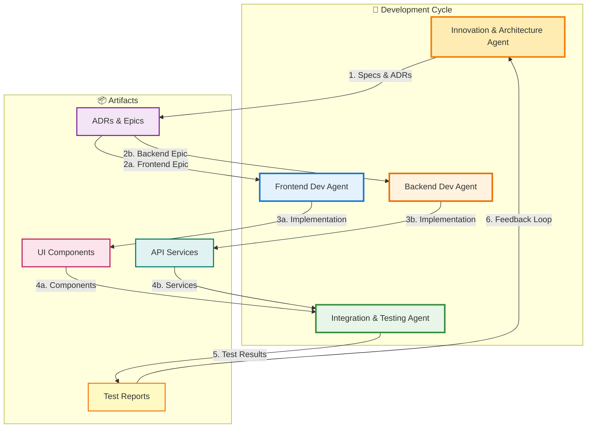

```mermaid
graph TB
    subgraph Development["🔄 Development Cycle"]
        IAA["Innovation & Architecture Agent"]
        FDA["Frontend Dev Agent"]
        BDA["Backend Dev Agent"]
        ITA["Integration & Testing Agent"]
    end
    
    subgraph Artifacts["📦 Artifacts"]
        ADR["ADRs & Epics"]
        UI["UI Components"]
        API["API Services"]
        TEST["Test Reports"]
    end
    
    IAA -->|"1. Specs & ADRs"| ADR
    ADR -->|"2a. Frontend Epic"| FDA
    ADR -->|"2b. Backend Epic"| BDA
    
    FDA -->|"3a. Implementation"| UI
    BDA -->|"3b. Implementation"| API
    
    UI -->|"4a. Components"| ITA
    API -->|"4b. Services"| ITA
    
    ITA -->|"5. Test Results"| TEST
    TEST -->|"6. Feedback Loop"| IAA
    
    style IAA fill:#ffecb3,stroke:#f57c00,stroke-width:3px
    style FDA fill:#e3f2fd,stroke:#1976d2,stroke-width:3px
    style BDA fill:#fff3e0,stroke:#ef6c00,stroke-width:3px
    style ITA fill:#e8f5e9,stroke:#388e3c,stroke-width:3px
    style ADR fill:#f3e5f5,stroke:#7b1fa2,stroke-width:2px
    style UI fill:#fce4ec,stroke:#c2185b,stroke-width:2px
    style API fill:#e0f2f1,stroke:#00796b,stroke-width:2px
    style TEST fill:#fff9c4,stroke:#f57f17,stroke-width:2px
```