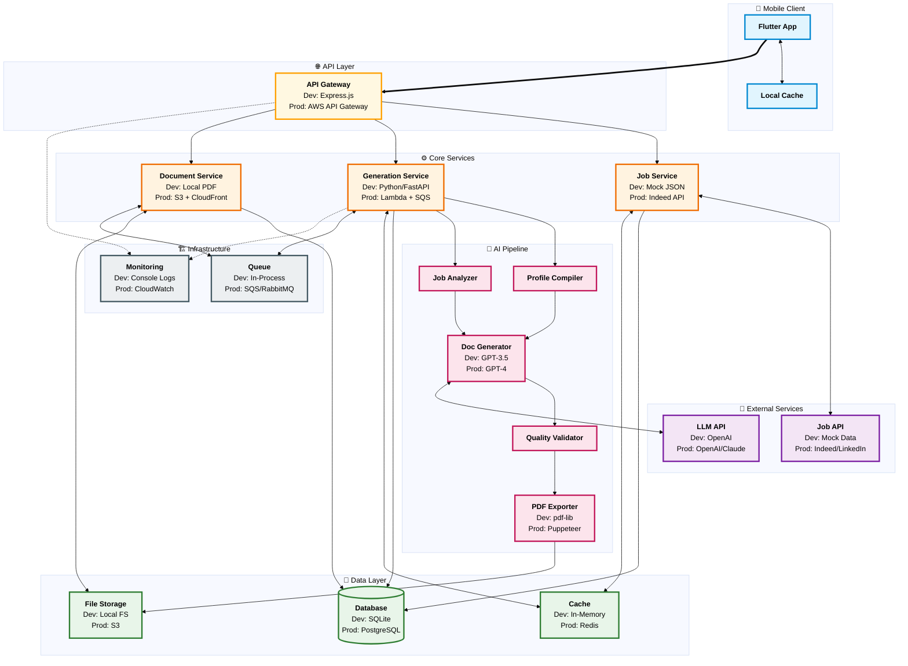

```mermaid
%%{init: {'theme':'base', 'themeVariables': { 'fontSize':'16px'}}}%%
graph TB
    subgraph MobileClient["📱 Mobile Client"]
        UI["<b>Flutter App</b>"]
        LC["<b>Local Cache</b>"]
    end
    
    UI <--> LC
    
    subgraph APILayer["🌐 API Layer"]
        AG["<b>API Gateway</b><br/>Dev: Express.js<br/>Prod: AWS API Gateway"]
    end
    
    UI ==> AG
    
    subgraph CoreServices["⚙️ Core Services"]
        JS["<b>Job Service</b><br/>Dev: Mock JSON<br/>Prod: Indeed API"]
        GS["<b>Generation Service</b><br/>Dev: Python/FastAPI<br/>Prod: Lambda + SQS"]
        DS["<b>Document Service</b><br/>Dev: Local PDF<br/>Prod: S3 + CloudFront"]
    end
    
    AG --> JS
    AG --> GS
    AG --> DS
    
    subgraph AIPipeline["🤖 AI Pipeline"]
        PC["<b>Profile Compiler</b>"]
        JA["<b>Job Analyzer</b>"]
        DG["<b>Doc Generator</b><br/>Dev: GPT-3.5<br/>Prod: GPT-4"]
        QV["<b>Quality Validator</b>"]
        PE["<b>PDF Exporter</b><br/>Dev: pdf-lib<br/>Prod: Puppeteer"]
    end
    
    GS --> PC
    GS --> JA
    PC --> DG
    JA --> DG
    DG --> QV
    QV --> PE
    
    subgraph ExternalServices["🔌 External Services"]
        LLM["<b>LLM API</b><br/>Dev: OpenAI<br/>Prod: OpenAI/Claude"]
        JOBS["<b>Job API</b><br/>Dev: Mock Data<br/>Prod: Indeed/LinkedIn"]
    end
    
    DG <--> LLM
    JS <--> JOBS
    
    subgraph DataLayer["💾 Data Layer"]
        DB[("<b>Database</b><br/>Dev: SQLite<br/>Prod: PostgreSQL")]
        CACHE["<b>Cache</b><br/>Dev: In-Memory<br/>Prod: Redis"]
        FS["<b>File Storage</b><br/>Dev: Local FS<br/>Prod: S3"]
    end
    
    JS --> DB
    GS --> DB
    DS --> DB
    JS <--> CACHE
    GS <--> CACHE
    PE --> FS
    DS <--> FS
    
    subgraph Infrastructure["🏗️ Infrastructure"]
        MQ["<b>Queue</b><br/>Dev: In-Process<br/>Prod: SQS/RabbitMQ"]
        MON["<b>Monitoring</b><br/>Dev: Console Logs<br/>Prod: CloudWatch"]
    end
    
    GS <--> MQ
    DS <--> MQ
    AG -.-> MON
    GS -.-> MON
    
    %% Styling
    classDef client fill:#e1f5fe,stroke:#0288d1,stroke-width:3px,color:#000
    classDef api fill:#fff8e1,stroke:#ffa000,stroke-width:3px,color:#000
    classDef service fill:#fff3e0,stroke:#ef6c00,stroke-width:3px,color:#000
    classDef pipeline fill:#fce4ec,stroke:#c2185b,stroke-width:3px,color:#000
    classDef external fill:#f3e5f5,stroke:#7b1fa2,stroke-width:3px,color:#000
    classDef data fill:#e8f5e9,stroke:#2e7d32,stroke-width:3px,color:#000
    classDef infra fill:#eceff1,stroke:#455a64,stroke-width:3px,color:#000
    
    class UI,LC client
    class AG api
    class JS,GS,DS service
    class PC,JA,DG,QV,PE pipeline
    class LLM,JOBS external
    class DB,CACHE,FS data
    class MQ,MON infra
```