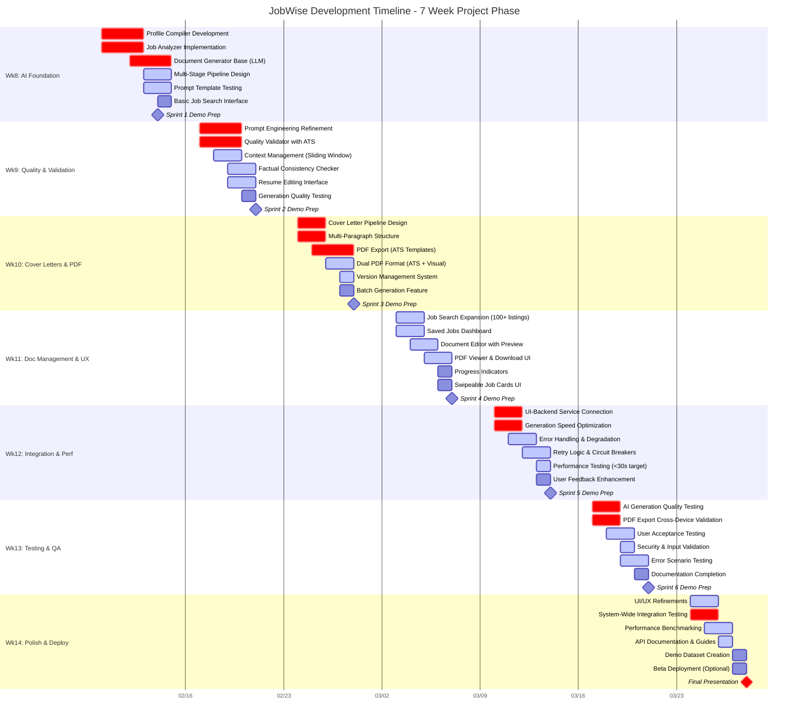

```mermaid
%%{init: {'theme':'default', 'gantt': {'useWidth':1400, 'leftPadding':180}}}%%
gantt
    title JobWise Development Timeline - 7 Week Project Phase
    dateFormat YYYY-MM-DD
    axisFormat %m/%d
    
    section Wk8: AI Foundation
        Profile Compiler Development       :crit, w8-task1, 2025-02-10, 3d
        Job Analyzer Implementation        :crit, w8-task2, 2025-02-10, 3d
        Document Generator Base (LLM)      :crit, w8-task3, 2025-02-12, 3d
        Multi-Stage Pipeline Design        :active, w8-task4, 2025-02-13, 2d
        Prompt Template Testing            :active, w8-task5, 2025-02-13, 2d
        Basic Job Search Interface         :w8-task6, 2025-02-14, 1d
        Sprint 1 Demo Prep                :milestone, w8-demo, 2025-02-14, 0d
    
    section Wk9: Quality & Validation
        Prompt Engineering Refinement      :crit, w9-task1, 2025-02-17, 3d
        Quality Validator with ATS         :crit, w9-task2, 2025-02-17, 3d
        Context Management (Sliding Window):active, w9-task3, 2025-02-18, 2d
        Factual Consistency Checker        :active, w9-task4, 2025-02-19, 2d
        Resume Editing Interface           :active, w9-task5, 2025-02-19, 2d
        Generation Quality Testing         :w9-task6, 2025-02-20, 1d
        Sprint 2 Demo Prep                :milestone, w9-demo, 2025-02-21, 0d
    
    section Wk10: Cover Letters & PDF
        Cover Letter Pipeline Design       :crit, w10-task1, 2025-02-24, 2d
        Multi-Paragraph Structure          :crit, w10-task2, 2025-02-24, 2d
        PDF Export (ATS Templates)         :crit, w10-task3, 2025-02-25, 3d
        Dual PDF Format (ATS + Visual)     :active, w10-task4, 2025-02-26, 2d
        Version Management System          :active, w10-task5, 2025-02-27, 1d
        Batch Generation Feature           :w10-task6, 2025-02-27, 1d
        Sprint 3 Demo Prep                :milestone, w10-demo, 2025-02-28, 0d
    
    section Wk11: Doc Management & UX
        Job Search Expansion (100+ listings):active, w11-task1, 2025-03-03, 2d
        Saved Jobs Dashboard               :active, w11-task2, 2025-03-03, 2d
        Document Editor with Preview       :active, w11-task3, 2025-03-04, 2d
        PDF Viewer & Download UI           :active, w11-task4, 2025-03-05, 2d
        Progress Indicators                :w11-task5, 2025-03-06, 1d
        Swipeable Job Cards UI             :w11-task6, 2025-03-06, 1d
        Sprint 4 Demo Prep                :milestone, w11-demo, 2025-03-07, 0d
    
    section Wk12: Integration & Perf
        UI-Backend Service Connection      :crit, w12-task1, 2025-03-10, 2d
        Generation Speed Optimization      :crit, w12-task2, 2025-03-10, 2d
        Error Handling & Degradation       :active, w12-task3, 2025-03-11, 2d
        Retry Logic & Circuit Breakers     :active, w12-task4, 2025-03-12, 2d
        Performance Testing (<30s target)  :active, w12-task5, 2025-03-13, 1d
        User Feedback Enhancement          :w12-task6, 2025-03-13, 1d
        Sprint 5 Demo Prep                :milestone, w12-demo, 2025-03-14, 0d
    
    section Wk13: Testing & QA
        AI Generation Quality Testing      :crit, w13-task1, 2025-03-17, 2d
        PDF Export Cross-Device Validation :crit, w13-task2, 2025-03-17, 2d
        User Acceptance Testing            :active, w13-task3, 2025-03-18, 2d
        Security & Input Validation        :active, w13-task4, 2025-03-19, 1d
        Error Scenario Testing             :active, w13-task5, 2025-03-19, 2d
        Documentation Completion           :w13-task6, 2025-03-20, 1d
        Sprint 6 Demo Prep                :milestone, w13-demo, 2025-03-21, 0d
    
    section Wk14: Polish & Deploy
        UI/UX Refinements                  :active, w14-task1, 2025-03-24, 2d
        System-Wide Integration Testing    :crit, w14-task2, 2025-03-24, 2d
        Performance Benchmarking           :active, w14-task3, 2025-03-25, 2d
        API Documentation & Guides         :active, w14-task4, 2025-03-26, 1d
        Demo Dataset Creation              :w14-task5, 2025-03-27, 1d
        Beta Deployment (Optional)         :w14-task6, 2025-03-27, 1d
        Final Presentation                :crit, milestone, w14-final, 2025-03-28, 0d
```