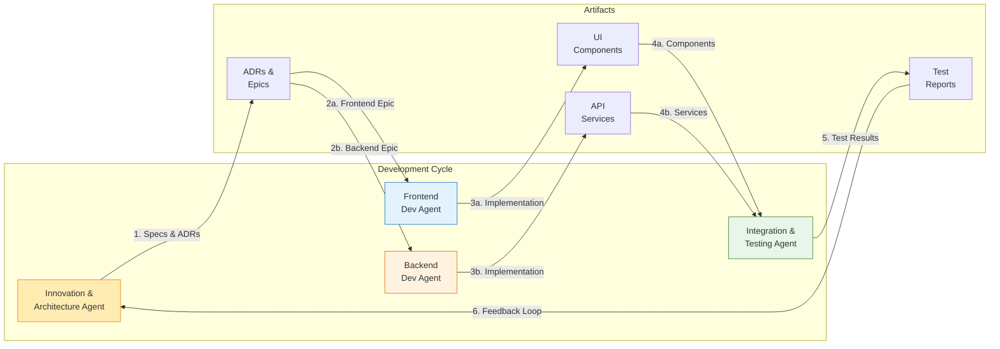
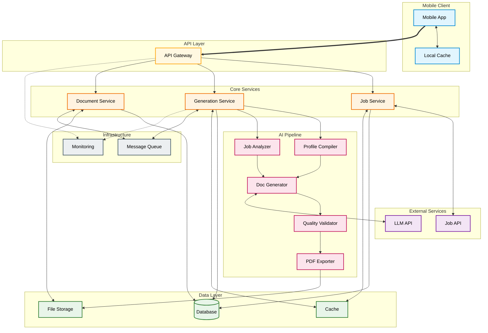
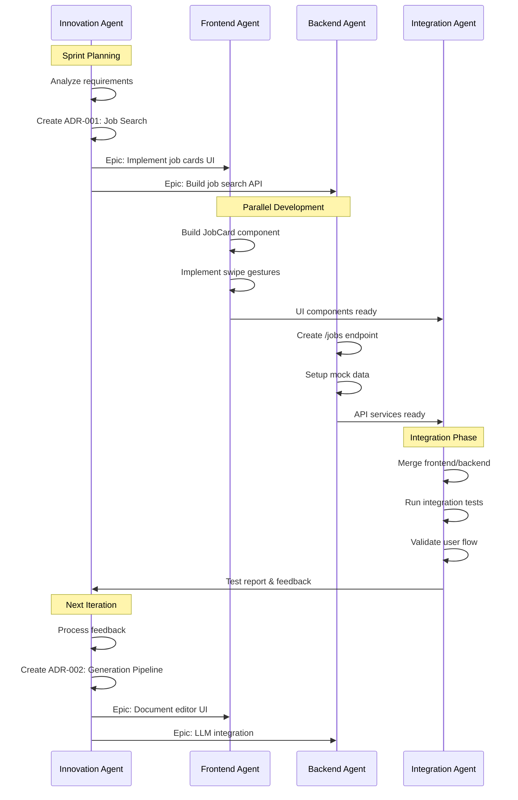

# Project Proposal: JobWise

---

## Part 1: Executive Summary & Vision

### Project Overview

Searching and applying for jobs is a repetitive and time-consuming task. Applicants, especially students and early-career professionals, often spend hours tailoring resumes and cover letters for each posting—an inefficient process that discourages personalization and slows down applications.

**JobWise** is a mobile application that automates and enhances this process through **AI-generated resume and cover letter tailoring**. Users can search and browse job postings, save positions of interest, then receive AI-generated application documents tailored to each specific role. Each document remains editable, allowing users to review, refine, and export as professional PDFs ready for submission.

The project's central focus is the **job search to application workflow**, with emphasis on AI-tailored document generation, prompt design, context management, and responsible AI use. During development, multiple **Agentic AI assistants** are coordinated to accelerate designing, coding, testing, and documentation while maintaining quality and version control.

**Success Vision:**
A successful JobWise prototype demonstrates a seamless user workflow:
1. Searching and browsing relevant job listings
2. Saving jobs of interest for application
3. Generating AI-tailored resumes and cover letters specific to each job
4. Reviewing and editing generated documents within the mobile interface
5. Exporting professional PDFs ready for submission

Success will be measured by the quality and relevance of AI-generated content, efficiency of the job search experience, professional quality of PDF exports, and smooth integration of developer AI tools throughout development.

---

### Target Audience & Use Cases

**Primary Users**
* University students and graduates applying for internships or entry-level roles
* Early-career professionals managing multiple job applications
* Mobile-first users seeking efficient, AI-assisted job search and application preparation
* Career changers needing tailored resumes for different industries

**Core Use Cases**
1. **Job Discovery:** User searches for positions using keywords and filters, browsing through swipeable job cards
2. **Job Saving:** User saves interesting positions to their application pipeline
3. **AI Tailoring:** Saving a job triggers AI generation of tailored resume and cover letter drafts specific to that position
4. **Document Review:** User reviews, edits, and refines AI-generated drafts before finalizing
5. **PDF Export:** User exports professional, ATS-compatible PDFs ready for submission

**Real-World Application**
JobWise directly addresses the modern job search challenge where applicants must customize applications for dozens of positions. It leverages AI to maintain personalization at scale while ensuring ethical use and user control over final outputs.

---

### Portfolio Positioning

**Career Relevance**
The project demonstrates professional-level integration of AI workflows, mobile app development, and document processing. It highlights skills in prompt engineering, system integration, and AI-assisted development—key competencies for modern software engineering and applied AI roles.

**Demonstration Value**
JobWise showcases the coordination of multiple AI development tools to produce a functional, user-ready mobile application. The focus on practical AI integration, from job search to document generation to PDF export, displays readiness for roles requiring end-to-end product development with AI augmentation.

---

### Track Specialization Identification

**Primary Track Focus:** Mobile Development Track

**Track Integration Justification**
JobWise exemplifies mobile-first design principles—swipe navigation, responsive layouts, offline capability, and native device integration. The project demonstrates fluency in cross-platform mobile development, while integrating sophisticated backend services for AI generation and document processing. The emphasis on mobile UX patterns, combined with complex state management and API orchestration, showcases advanced mobile development competency.

---

## Part 2: Technical Architecture & Multi-Agent Design

### Agent Architecture Design

**Agent Specifications**

```
Agent Name: Innovation & Architecture Agent
Primary Responsibility: Generate technical specifications, create epics, propose architectural improvements, maintain project vision
Input: Current system state, performance metrics, test results, integration feedback
Output: ADRs, feature epics, technical specifications, architecture refinements, context summaries
Coordination Pattern: Initiates development cycles, receives feedback from Integration Agent to inform next iteration
Failure Handling: Non-blocking - development continues with existing specs if unavailable
Context Handoff: Produces ADR documents and epic specifications with clear acceptance criteria
```

```
Agent Name: Frontend Development Agent  
Primary Responsibility: Implement mobile UI components, user interactions, state management
Input: Feature epics, UI/UX requirements, API contracts from Architecture Agent
Output: Mobile UI components, navigation flows, local cache logic, API integration code
Coordination Pattern: Receives specs from Architecture Agent, passes implementation to Integration Agent
Failure Handling: Falls back to basic UI components, maintains local functionality without backend
Context Handoff: Generates implementation summary with component documentation and API usage patterns
```

```
Agent Name: Backend Development Agent
Primary Responsibility: Build API endpoints, generation pipeline, data persistence, external service integration
Input: Feature epics, API specifications, data models from Architecture Agent  
Output: API endpoints, generation logic, database schemas, service integrations
Coordination Pattern: Receives specs from Architecture Agent, passes implementation to Integration Agent
Failure Handling: Returns mock data, queues failed operations, implements circuit breakers
Context Handoff: Provides API documentation, service dependencies, and configuration requirements
```

```
Agent Name: Integration & Testing Agent
Primary Responsibility: Merge frontend/backend work, conduct testing, validate requirements, ensure system coherence
Input: Frontend components, backend services, test criteria from development agents
Output: Integrated features, test reports, bug findings, performance metrics
Coordination Pattern: Receives implementations from dev agents, sends feedback to Architecture Agent
Failure Handling: Isolates failing components, runs partial tests, documents integration issues
Context Handoff: Creates test reports and integration feedback for next iteration planning
```

**Agent Coordination Workflow**



**Context Handoff Mechanism**

The agents maintain a continuous development cycle through structured documentation handoffs. The Innovation & Architecture Agent begins each iteration by analyzing the current state and creating Architecture Decision Records (ADRs) that define the technical approach and acceptance criteria. These ADRs serve as the authoritative specification that guides both Frontend and Backend Development Agents.

During the implementation phase, both development agents work in parallel using the shared ADR specifications. The Frontend Agent focuses on mobile UI components while the Backend Agent builds the corresponding API services and data pipelines. Each agent maintains implementation summaries documenting their work, dependencies, and integration points.

The Integration & Testing Agent receives the parallel implementations and performs comprehensive validation. This includes merging the frontend and backend work, running test suites, and validating that the integrated system meets the original ADR requirements. Test reports capture both successes and failures, providing crucial feedback for the next iteration.

This feedback loop ensures continuous improvement as the Integration Agent's findings inform the Architecture Agent's next round of specifications, creating an iterative refinement process that improves system quality with each cycle.

### Application Architecture Design

**System Architecture**



**Development Flow with Agent Coordination**



### AI-Tailored Document Generation Architecture

**Generation Pipeline Workflow**

The document generation system implements a sophisticated AI pipeline orchestrated by the Backend Development Agent. The core innovation lies in transforming a master resume into job-specific versions through intelligent content selection and reformation.

**Stage 1: Job Description Parsing & Analysis**

The Job Analyzer employs structured extraction using LLM-based parsing. The system processes raw job descriptions to extract:
- Required skills (technical and soft skills explicitly mentioned)
- Experience requirements (years of experience, specific domains)
- Key responsibilities (primary duties and expectations)
- Company context (industry, company size, team structure)
- Cultural indicators (work style, values, team dynamics)
- ATS keywords (industry-specific terms and phrases)

The extraction uses few-shot learning with examples of well-parsed job descriptions to ensure consistent output format. The system validates the structured output and re-prompts if parsing fails, with fallback to pattern-based extraction for critical fields.

**Stage 2: Master Resume Analysis & Selection**

The Profile Compiler maintains a comprehensive master resume containing the user's complete professional history. Rather than generating content from scratch, it intelligently selects and prioritizes existing content:

The system uses semantic similarity matching between job requirements and master resume sections. Each experience, skill, and achievement receives a relevance score based on keyword overlap, semantic meaning alignment, and recency weighting. Experiences with high relevance scores become primary content, while related experiences serve as secondary candidates. Skills are ranked by frequency in job description and user proficiency, and achievements are filtered for quantifiable results matching job needs.

**Stage 3: Tailored Document Generation**

The Document Generator employs a multi-pass approach:

**Content Assembly**: Using scored selections from Stage 2, the system constructs prompts containing prioritized experiences and skills. The LLM rewrites these selections emphasizing aspects that match job requirements while maintaining factual accuracy.

**Keyword Optimization**: A second pass analyzes generated content against extracted ATS keywords, naturally incorporating missing critical terms without keyword stuffing. The system maintains optimal keyword density for ATS systems.

**Professional Summary Generation**: The final pass creates a tailored professional summary by synthesizing the most relevant experiences with the job's key requirements, positioning the candidate as an ideal match while remaining truthful to their actual experience.

**Cover Letter Generation**: Parallel to resume generation, the system creates a structured cover letter with opening connection to company/role, body paragraphs with specific examples demonstrating fit, and closing with call to action and cultural alignment.

**Stage 4: Quality Validation & Refinement**

The Quality Validator performs multi-dimensional assessment:

**Factual Consistency**: Compares generated content against the master resume using semantic similarity to ensure no fabrication or exaggeration. Statements not traceable to original content trigger regeneration with stricter constraints.

**ATS Optimization**: Analyzes keyword presence and distribution, validates standard resume section headers, ensures no complex formatting that could confuse ATS systems, and checks for compliance with common ATS requirements.

**Readability Assessment**: Evaluates sentence complexity, paragraph length, and overall readability targeting professional document standards.

**Coherence Validation**: Uses separate LLM evaluation to assess the document's logical flow, consistency, and professional tone. Failed validations return to Stage 3 with specific improvement instructions.

**Stage 5: Interactive Editing & Export**

The system maintains generated content in structured format, allowing granular editing of individual sections. Each edit triggers local coherence checks to maintain document quality. Version management creates snapshots of every generation and edit, allowing users to compare different tailoring attempts or revert to previous versions.

The PDF Export pipeline transforms structured content into professional formats with ATS-optimized templates, standard fonts for compatibility, consistent spacing and margins, and both single-column ATS versions and visually enhanced versions for human readers.

**Context Management Strategy**

The system maintains context across multiple LLM calls using a sliding window approach. Core context (user ID, job ID) persists across all calls while relevant sections from the master resume are included as needed. Previous generation passes are included for refinement iterations, with token allocation optimized for each stage of generation.

Each prompt follows a consistent structure with system role definition, task specification with clear output format, context injection, constraints and quality criteria, and few-shot examples for complex tasks. The system dynamically adjusts prompt verbosity based on available token budget, prioritizing essential information while maintaining generation quality.

### Technology Stack & MCP Integration

**Technology Stack Recommendations**

| Component | Development Environment | Production Environment | Purpose |
|-----------|------------------------|----------------------|----------|
| **Mobile Framework** | Flutter with Hot Reload | Flutter Release Build | Cross-platform mobile development |
| **API Gateway** | Express.js | AWS API Gateway | Request routing and authentication |
| **Job Data Source** | Mock JSON (100+ samples) | Indeed/LinkedIn API | Job listings and descriptions |
| **LLM Provider** | GPT-3.5 Turbo | GPT-4 / Claude 3 | Document generation and analysis |
| **Database** | SQLite | PostgreSQL + Read Replicas | User data and application state |
| **Cache Layer** | In-Memory Map | Redis Cluster | Performance optimization |
| **PDF Generation** | pdf-lib (JavaScript) | Puppeteer + Headless Chrome | Document export |
| **Message Queue** | In-Process Array | SQS / RabbitMQ | Async job processing |
| **File Storage** | Local Filesystem | AWS S3 + CloudFront | Document and template storage |
| **Monitoring** | Console Logging | CloudWatch + Datadog | System observability |
| **Backend Framework** | Python FastAPI | AWS Lambda + API Gateway | API and generation services |
| **Authentication** | Mock Auth | Firebase Auth / Auth0 | User identity management |
| **Search Engine** | Array Filter | Elasticsearch | Job search and filtering |
| **CDN** | Local Assets | CloudFront | Static asset delivery |

**Model Context Protocol (MCP) Implementation**

The MCP strategy manages context across multiple LLM interactions through:

**Sliding Window Context**: Maintains 8000 token windows with 500 token overlap between calls, preserving critical information while managing token limits.

**Prompt Chaining Architecture**: 
- Profile extraction (2000 tokens, low temperature for accuracy)
- Job analysis (1500 tokens, low temperature for precision)
- Resume generation (3000 tokens, moderate temperature for creativity)
- Optimization pass (1500 tokens, balanced temperature)

**Context Preservation**: Uses semantic compression for long profiles, relevance-based pruning of experiences, and dynamic token allocation based on generation stage.

**Response Management**: Structured JSON output with schema validation, error handling with retry logic, and fallback to simpler prompts on failure.

### Professional Practices Integration

**Quality Assurance Through Agent Collaboration**

Each agent maintains specific quality standards contributing to overall system excellence:

**Innovation Agent Standards**: All architectural decisions documented as ADRs with clear rationale, epics include measurable acceptance criteria, and performance targets defined upfront.

**Frontend Agent Standards**: Component testing for all UI elements, accessibility compliance (WCAG 2.1), responsive design for all screen sizes, and intuitive user interaction patterns.

**Backend Agent Standards**: API documentation following OpenAPI 3.0 specification, comprehensive input validation, graceful degradation patterns, and error handling at every level.

**Integration Agent Standards**: Automated test suites covering unit, integration, and end-to-end scenarios, performance benchmarking on each build, and security scanning for vulnerabilities.

**Continuous Improvement Workflow**

The feedback loop between agents creates a self-improving system. Test results from the Integration Agent inform architectural refinements by the Innovation Agent. Performance metrics guide optimization efforts across both Frontend and Backend agents. User feedback captured through the mobile interface influences future epic priorities.

**Error Handling Strategy**

The system implements comprehensive error handling through:
- Frontend resilience with offline capability and optimistic updates
- Backend fault tolerance with circuit breakers and retry logic
- Graceful degradation when external services unavailable
- User-friendly error messages with actionable recovery steps
- Comprehensive logging for debugging and monitoring

**Monitoring & Observability**

System health tracked through:
- API response time metrics (target: <2s for search, <30s for generation)
- Generation quality scores and user edit frequency
- Error rates and recovery success
- User journey completion rates
- Resource utilization and cost metrics

---

## Part 3: Individual Project Management & Development Planning

### Timeline & Sprint Planning

```
Week 8: Sprint 1 – AI Generation Foundation & Core Pipeline
- [ ] Build Profile Compiler with user data extraction and structuring
- [ ] Develop Job Analyzer for requirement parsing and keyword extraction
- [ ] Create base Document Generator with LLM integration (resume focus)
- [ ] Implement multi-stage generation pipeline (analysis → drafting → optimization)
- [ ] Design and test prompt templates for resume tailoring
- [ ] Build basic job search interface with mock data (50+ listings)
- [ ] Sprint 1 demo: AI-generated tailored resume from job description

Week 9: Sprint 2 – Resume Generation Quality & Validation
- [ ] Refine prompt engineering for better job-profile matching
- [ ] Implement Quality Validator with ATS scoring and keyword analysis
- [ ] Add context management for sliding window LLM calls
- [ ] Build factual consistency checker against master resume
- [ ] Create resume editing interface with section-level controls
- [ ] Test generation quality across diverse job descriptions
- [ ] Sprint 2 demo: High-quality tailored resumes with ATS optimization

Week 10: Sprint 3 – Cover Letter Generation & PDF Export
- [ ] Design cover letter generation pipeline with tone variations
- [ ] Implement multi-paragraph structure with company research integration
- [ ] Create PDF export with professional, ATS-compatible templates
- [ ] Add both single-column ATS and visually enhanced PDF formats
- [ ] Build version management for comparing generation iterations
- [ ] Implement batch generation for multiple saved jobs
- [ ] Sprint 3 demo: Complete resume + cover letter generation with PDF export

Week 11: Sprint 4 – Document Management & User Experience
- [ ] Expand job search to 100+ mock listings with filters and sorting
- [ ] Build saved jobs management dashboard with generation status
- [ ] Implement document editing with live preview and coherence checks
- [ ] Add PDF viewer and download functionality in mobile interface
- [ ] Create progress indicators for multi-stage generation pipeline
- [ ] Polish mobile UI with swipeable job cards and intuitive navigation
- [ ] Sprint 4 demo: Polished job-to-application workflow

Week 12: Sprint 5 – Integration & Performance Optimization
- [ ] Connect all UI components to backend generation services
- [ ] Optimize generation speed through caching and prompt compression
- [ ] Implement error handling and graceful degradation patterns
- [ ] Add retry logic and circuit breakers for LLM service failures
- [ ] Performance testing: target <30s for resume generation, <45s for cover letter
- [ ] Enhance user feedback during generation process
- [ ] Sprint 5 demo: Fast, reliable end-to-end application workflow

Week 13: Sprint 6 – Testing & Quality Assurance
- [ ] Comprehensive testing of AI generation quality across job types
- [ ] Validate PDF exports across devices and ATS systems
- [ ] User acceptance testing with real job descriptions
- [ ] Security testing and input validation
- [ ] Error scenario testing and recovery validation
- [ ] Documentation completion for all generation components
- [ ] Sprint 6 demo: Production-ready AI generation system

Week 14: Sprint 7 – Final Polish & Deployment Preparation
- [ ] Final UI/UX refinements based on testing feedback
- [ ] System-wide integration testing and bug fixes
- [ ] Performance benchmarking and optimization
- [ ] Complete API documentation and deployment guides
- [ ] Create demo dataset with diverse job examples
- [ ] Optional: Deploy beta version to TestFlight/Firebase App Distribution
- [ ] Final presentation with live demo showcasing AI generation capabilities
```

### Individual Development Plan

**Personal Role & Responsibilities**

As the sole developer, primary focus areas in priority order:
1. **Job Search Specialist**: Implement efficient job discovery and filtering
2. **AI Generation Engineer**: Design and refine document generation pipeline
3. **PDF Export Developer**: Ensure professional, ATS-compatible outputs
4. **Prompt Engineer**: Create optimized prompts for tailored content
5. **Mobile Developer**: Build intuitive search and document management UI

**Development Tools & Workflow**
- **IDE**: Visual Studio Code with GitHub Copilot for accelerated development
- **AI Agents**: GPT-4 for prompt design, Claude for architecture decisions, Copilot for rapid implementation
- **Testing**: Mock job data testing, PDF visual regression, generation quality validation
- **Version Control**: Feature branches for search, generation, and export modules
- **Project Management**: Taskmaster MCP for task tracking and AI agent coordination

**Development Methodology**

AI-generation focused agile approach prioritizing document quality:
- **Weeks 8-9**: AI generation pipeline foundation and resume quality optimization
- **Week 10**: Cover letter generation and professional PDF export
- **Weeks 11-12**: User experience polish and system integration
- **Weeks 13-14**: Comprehensive testing, optimization, and deployment preparation

Each sprint delivers functional milestones with continuous AI agent coordination for faster development and iterative prompt engineering refinement. The extended timeline allows for deeper focus on generation quality, comprehensive testing, and production-ready deployment.

**Self-Management Strategy**
- Daily testing of AI generation quality with diverse job descriptions
- Maintain generation quality metrics dashboard (ATS scores, keyword density, coherence)
- Track prompt effectiveness and iteration improvements
- Bi-weekly sprint retrospectives to reassess priorities and adjust timeline
- Continuous documentation of AI coordination patterns and generation strategies
- Weekly progress reports measuring against generation quality targets

### Scope & Feasibility Analysis

**Core Features (MVP) - Prioritized**
1. **Job Search & Discovery** - Browse and filter job listings with intuitive interface
2. **AI-Tailored Resume Generation** - Match user profile to specific job requirements
3. **AI-Tailored Cover Letter Generation** - Professional, job-specific letters with appropriate tone
4. **PDF Export** - ATS-compatible, professional formatting ready for submission
5. **Document Management** - Save, edit, and organize generated applications
6. **Quality Validation** - ATS scoring and keyword optimization feedback

**Stretch Goals**
- **Automated Job Scanning**: Real-time job alerts and auto-import from job boards
- **DOCX Export**: Microsoft Word format for additional flexibility
- **Application Tracking**: Monitor application status and follow-ups
- **Multi-format Templates**: Industry-specific resume designs
- **Batch Operations**: Generate documents for multiple jobs simultaneously
- **Full Deployment**: Release to App Store/Play Store
- **API Integration**: Live job data from Indeed/LinkedIn/Glassdoor

**Scope Boundaries**
- No automated job application submission to external sites
- No real-time job scraping or live API integration (use curated mock data)
- No real-time collaboration features
- Limited to English language generation
- No payment processing or premium features
- No employer-side features or recruiter tools
- No mobile app store deployment required (TestFlight/Firebase distribution optional)

**Feasibility Validation**

**7-Week Timeline Justification:**
The extended timeline provides realistic buffer for the AI generation complexity:
- **Weeks 8-9**: Focus exclusively on generation pipeline development and prompt engineering (14 days)
- **Week 10**: Dedicated to cover letter generation and PDF export quality (7 days)
- **Weeks 11-12**: Integration and user experience refinement (14 days)
- **Weeks 13-14**: Comprehensive testing, optimization, and production readiness (14 days)

**Technical Feasibility:**
- Flutter enables rapid mobile UI development with hot reload
- Mock job data eliminates external API dependencies and rate limits
- LLM APIs (GPT-4/Claude) proven reliable for document generation
- PDF export libraries mature and well-documented
- SQLite provides simple persistence without complex database setup

**Development Velocity:**
With AI agent coordination, estimated throughput:
- Frontend development: ~20 hours/week with Copilot assistance
- Backend generation logic: ~15 hours/week with GPT-4/Claude architectural guidance
- Testing and refinement: ~10 hours/week with automated test generation
- Total: ~45 hours/week across 7 weeks = 315 development hours

**Risk Mitigation:**
- Extended timeline (7 weeks vs typical 4-week projects) provides 75% additional buffer
- Modular architecture allows deferring non-critical features to stretch goals
- Mock data eliminates external API failure risks
- Early focus on generation quality ensures core value proposition delivered first
- Incremental sprint demos enable early problem detection and course correction
- Two full weeks dedicated to testing and optimization ensures production quality

---

## Part 4: Foundation Phase Integration & Reflection

### Concept Integration

**Assignment 1 Connection: AI Tool Ecosystem Exploration**
JobWise builds upon the initial exploration of AI tools by orchestrating multiple developer AI agents throughout the development lifecycle. The project demonstrates practical application of various AI assistants for architecture design, rapid coding, and code review optimization.

**Assignment 2 Evolution: System Architecture Design**
The project advances beyond static system design to implement a dynamic, modular architecture. The separation of job search, generation pipeline, and PDF export modules allows for component swapping without system rewrites.

**Assignment 3 Advancement: Multi-Agent Coordination**
JobWise transforms theoretical multi-agent concepts into a practical coordination model where Frontend, Backend, Integration, and Innovation agents work together. Each agent has clear responsibilities and coordination patterns, demonstrating mastery of distributed system design.

**Assignment 4 Enhancement: MCP Integration**
The project implements sophisticated context management through the Model Context Protocol, maintaining conversation context across multiple LLM calls for document generation. The sliding window pattern and prompt chaining demonstrate advanced MCP implementation.

**Track-Specific Integration: Mobile Development Excellence**
The project showcases advanced mobile development competency through cross-platform capabilities, swipeable interfaces and gesture navigation, offline-first architecture with local caching, responsive design for various screen sizes, and native PDF generation capabilities.

### Professional Growth Demonstration

**Skill Progression**
This project represents a journey from Week 1's tool exploration to Week 7's comprehensive system design, demonstrating understanding and implementation of AI capabilities, multi-agent coordination patterns, professional development practices, and synthesized knowledge creation.

**Professional Practices Implementation**
- **Error Handling**: Comprehensive failure recovery at every system level
- **Testing Strategy**: Multi-layered testing from unit to end-to-end
- **Documentation**: Professional API specs and user guides
- **Performance Optimization**: Meeting specific metric targets
- **Security**: PII protection and input sanitization throughout

**Quality Standards**
JobWise demonstrates professional-level development through clean architecture with clear separation of concerns, comprehensive error handling and logging, performance optimization for mobile constraints, user-centered design with intuitive workflows, and production-ready features like PDF export and offline capability.

---

## Non-Technical Requirements

### Security Requirements
- Encrypt user-generated documents locally and in cloud storage
- Implement token-based authentication for secure API access
- Prevent PII exposure in prompts and logs
- Maintain auditable logs of AI-related document operations
- Support full user data export and deletion (GDPR compliance)

### User Experience Goals
- Two-tap workflow from job discovery to tailored document viewing
- Sub-3-second job search results display
- Under 30-second document generation time
- Editable AI outputs with transparent progress indicators
- Professional PDF exports matching industry standards

### Compliance Requirements
- **Ethical AI**: Prohibit fabrication or exaggeration of qualifications
- **Transparency**: Clear AI usage disclaimers before document generation
- **Data Privacy**: Follow GDPR-equivalent data protection practices
- **Accessibility**: WCAG 2.1 AA compliance for mobile interfaces

---

## Summary

**JobWise** represents the culmination of Foundation Phase learning, combining job search, AI-powered document generation, and professional PDF export into a cohesive mobile application. The project demonstrates:

1. **Technical Excellence**: Multi-agent architecture with clear separation of concerns
2. **AI Integration**: Sophisticated prompt engineering and context management
3. **Mobile Expertise**: Cross-platform development with native features
4. **Professional Standards**: Industry-level error handling, testing, and documentation
5. **User Focus**: Streamlined workflow from job discovery to application submission

The modular design ensures flexibility for future enhancements while maintaining a clear path to MVP delivery within the 7-week timeline. AI-assisted development accelerates implementation while maintaining code quality and professional standards.

**Final Deliverable**: A production-ready mobile application enabling users to search jobs, generate tailored application documents, and export professional PDFs—all powered by coordinated AI agents and built with industry best practices.